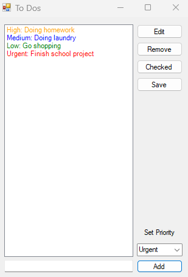

# To Do List App with Csharp and WinForm
A simple yet functional to-do list application built with C# and Windows Forms for beginners (by techwithlinh and gpt4).

## Table of Contents
- Features
- Getting Started
- Prerequisites
- Installing
- Built With
- Authors
- License
- Acknowledgments

### Features
This simple to do list application allows you to:

1. Add tasks with priorities
2. Edit existing tasks
3. Mark tasks as completed
4. Remove tasks from the list
5. Save tasks between sessions
6. Set priorities

### Getting Started
These instructions will get you a copy of the project up and running on your local machine for development and testing purposes.

### Prerequisites
- .NET Framework
- Visual Studio Community 2022 (or later)

### Installing
1. Clone the repo: git clone https://github.com/techwithlinh/ToDoList_App_Csharp.git
2. Navigate to the 'WinForm Projects/WinForm To Do List' directory
3. Open the solution in Visual Studio
4. Build the solution to restore NuGet packages
5. Run the application

### Built With
- C#
- Windows Forms

### Authors
**techwithlinh**

### License
This project is licensed under the MIT License - see the LICENSE.md file for details.

### Acknowledgments
OpenAI's GPT-4 for assisting in the project development and learning.
